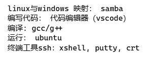
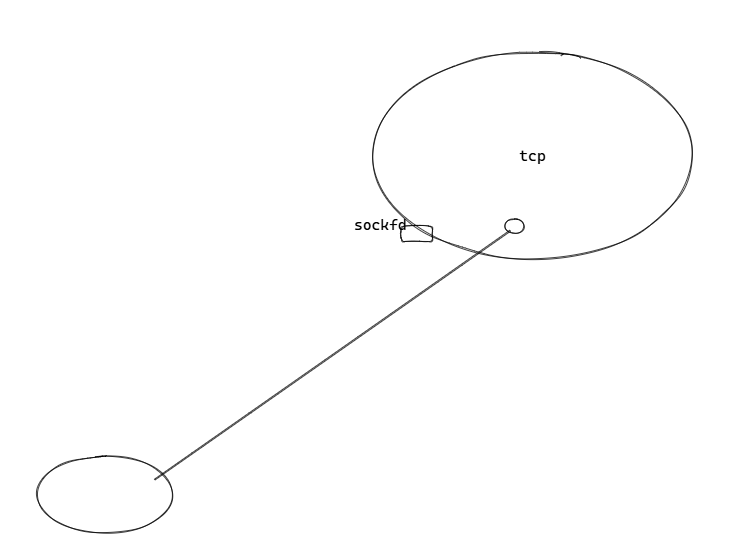

# 2.1.1-Network-Io
## 0voice first lesson
本节课主要两个方面，零声课程的学习方式与Network_io（本节课完成networkio.c）

### 一. 学习方式与环境配置
首先明确课程项目可以自命名，自己使用在业务场景，即可用于解决什么问题

从专栏二开始学习，专栏一通过后面的学习来渗透，专栏二网络编程，专栏三基础组件（轮子），专栏四中间件，专栏五开源框架，等等。均有对应项目的练习完善。本课程使用的环境如下，代码编辑可以自行选择



**Samba**的配置参考：【在Ubuntu上搭建Samba服务，实现与windows之间的文件共享】https://www.bilibili.com/video/BV1Eo4y1P7ub?vd_source=cf055197e2f5e559837296c2827dbee8

我选择的代码编辑器为**Source Insight4.0**,完整下载、激活配置参考
https://blog.csdn.net/ych9527/article/details/114324451

课程使用到**TCP\UDP Net Assist**,也需下载

# 二. 代码理解
代码见**networkio.c**,实现一个TCP Server端逻辑

可以用以下指令查看端口信息  
```
netstat -anop | grep port
```



TCP Server端需要**Listen**，使用**socket**函数处理，这里无论使用何种编程语言，底层都是socket嵌套字处理，[Port与IP address]

使用**bind**处理Server端的socket (设置为IP 0.0.0.0与端口 2000),表示在2000处监听、TCP连接，只要本地的几个IP地址接收到即可进入**Accept**（可以在Linux终端使用**ifconfig**查看网关、lo等IP），**Recv**和**Send**函数用于接收到缓存，并回显至clientfd

一共尝试了三种代码，简单说说前两种（待完善的两种）  
1. 简单的Listen,单次Accept,Recv,Send,未处理Client端多次发送信息，或者多个Client端连接Server的情况   
2. 添加了循环处理多个Client端连接，但内部逻辑有误，代码可能阻塞在顺序靠前连接的Client的Recv处，导致未进入下一个Client对应的循环  
3. 使用多线程的处理方式，一请求一线程的处理方式，且每一个线程中使用循环处理该客户端的多次发送，能较好地处理多Client、多次发送信息的情况

注意：  
1. 端口被绑定后，不能再次被绑定
2. 执行listen,可以通过netstat看到io状态
3. 进入listen可以被连接，同时产生新连接状态
4. io与tcp连接，一个tcp连接对应一个clientfd（userinfo），对应一个io
